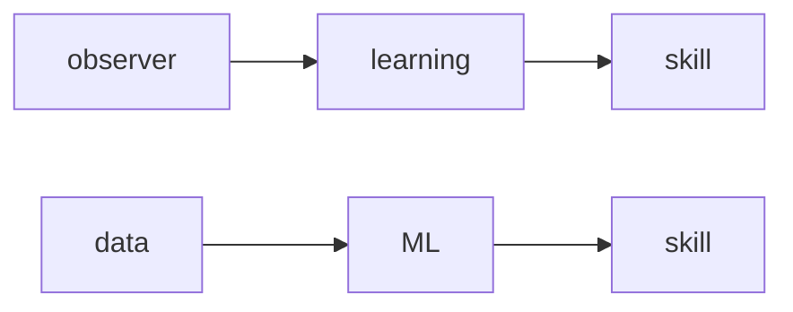
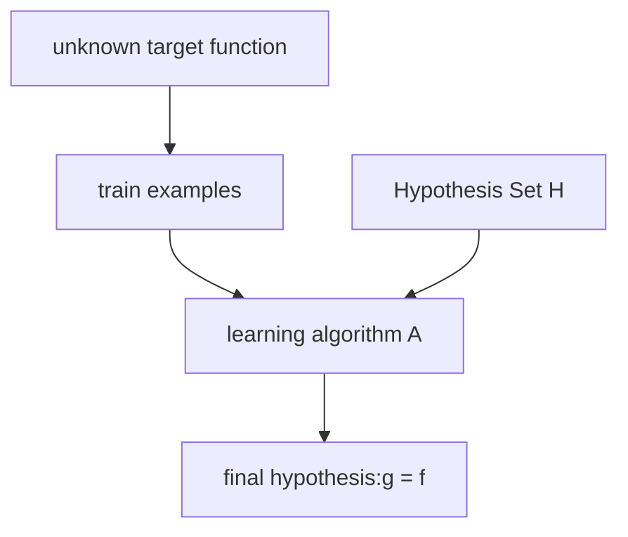
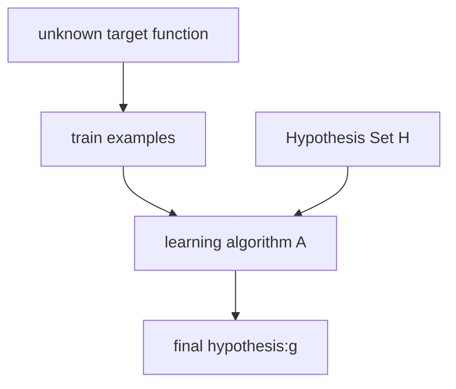

[TOC]
# 1 The learning problem
## 1.concepts
按照人类的学习方式，来对机器学习做描述

根据上图，归结出机器学习的三要素
1. exists some 'underlying pattern' to be learned
2. but no programmable definition
3. somehow there is data about the pattern

根据以上三要素来对某个事件做评价：是否适合用机器学习来处理

机器学习本质是对数据的分析拟合

机器学习实质上是一门数据处理学科

## 2. An example : Perceptron Algorithm
**感知机：用超平面对数据做二划分，将该超平面称决策边界**

## Preceptron Model
 $h(x) = sign(\sum_{i=1}^{n}x_iw_i - thresold)$
 跟神经网络中的神经元模型一样，用权重*Wi*和偏置*thresold*对输出做控制
 令$thresold = x_0w_0$
 最终得到
 h(x) = $sign(\sum_{i=0}^{n}x_iw_i)$=$sign(w^\mathrm T x)$
  其中$w^\mathrm T x$是$\vec{w}$和$\vec{x}$的内积
  进而有$y = h(x) = w^\mathrm T x/ |w^\mathrm T x|$
 ## Preceptron Learning Algorithm
 在算法做决策边界确定时，不可能首次就得到合适的决策边界
 故首先就直接使用错误的曲线做决策边界
 $h(x) = w_t^\mathrm T x$
 用数据做演算，当有$sign(w_t^\mathrm T x_n) \neq y_n$时
 说明当前的决策边界时有误差的
 故对决策边界做更新
 $w_{t+1} = w_t + y_nx_n$
 相当于是对当前的超平面做一定程度的旋转
 
 
 [图片上传中...(image-F7MpLZdjAwFldnSZ)]可见，正确标签为y = +1时，是将w向x方向旋转作修正
 
正确标签为y = -1时，是将w向x的负方向旋转作修正

从某种意义上来看，感觉和梯度下降相似

PLA算法可行的前提条件:
&ensp;&ensp;&ensp;&ensp;llinearly separable 线性可分

当数据集不是线性可分时，使用改进的感知机算法：pocket algorithm
不再要求对每个点都完成正确划分，转而求其次，令尽可能多的点符合求解的$h(x)$

## 3.补充部分
&emsp;&emsp;对于监督学习而言，虽然数据集中没有待求函数$f$，但数据本身是有系统输出的，可以通过数据集的训练来对目标函数作逼近，通过不同数据的检验来对当前模型作修正，有明确的目标。最终满足$g\approx f$

其中，在感知机算法中，假说集$H$就就是每一条线性决策边界组成的集合
&emsp;
&emsp;

&emsp;&emsp;而无监督学习和强化学习的数据所含信息要更少
