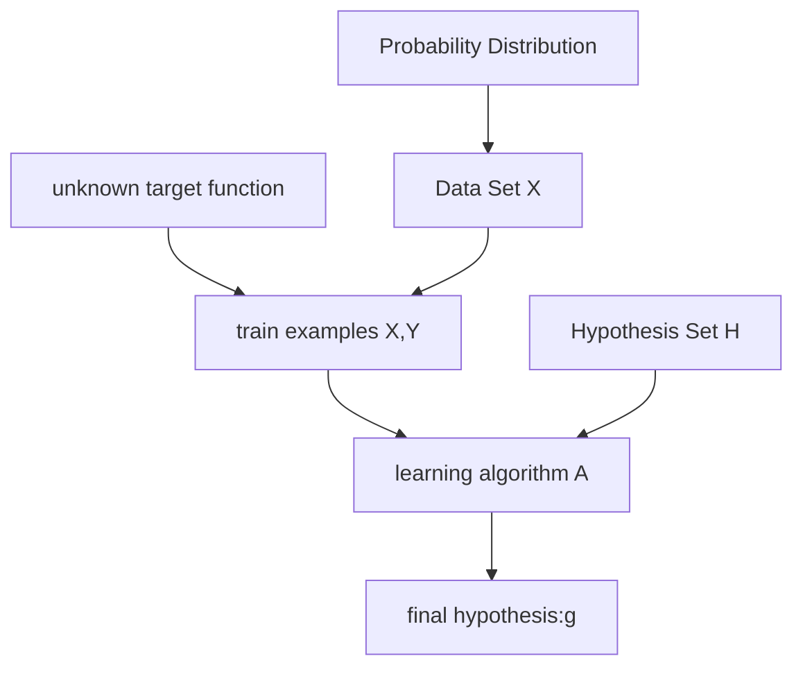

[TOC]
# Is Learning Feasible
## 1. Introdution
&emsp;&emsp;对于上一话中的感知机算法，假设在已知数据集中，对模型进行反复修正，最终我们得到了一个模型$g$，其中对于当前数据集中的每个数据，模型$g$都能准确预测。但是，当将模型对数据集以外的数据进行测试时，当前模型$g$还能准确预测吗？抑或是当前模型只是记住了当前数据集中的数据独特特征，而非通用特征？
## 2. Is Learning Feasible
### A related experiment
当前有一个箱子，内部只有红色和绿色两种颜色小球（数量无限），抽取结果相互独立

显然概率分布满足：
=>$p(red) = \mu$
&emsp;&ensp;$p(green) = 1-\mu$
其中$\mu$是未知量（实际频率）
&emsp;

现在使用当前抽取结果对模型作训练得到样本概率 $\nu$
样本数量够多时，显然会有：$\mu \approx \nu$
最终会有
$p(\text{bad  events})\leq m$ 

$p(\vert\mu - \nu\vert \gt \epsilon)\leq e^{-{\epsilon^2}N}$ 
希望$\mu$和$\nu$的差别非常小，即可以将样本频率$\nu$近似作为$\mu$来在计算中使用
&ensp;
&ensp;

**Hoeffding's lnequality:**
$p(\vert\mu - \nu\vert \gt \epsilon)\leq 2e^{-{2\epsilon^2}N}$ 
使用此不等式对$\nu$作限制，不等式的限制条件中不含未知量$\mu$
在此不等式中，显然当实验次数$N$越大时，$\epsilon$就越小，即样本频率$\nu$与实际频率$\mu$就越接近
&emsp;
&emsp;
## 3.Connect with Learning
将这个例子与Learning联系起来：
&emsp;1. functon:$h(x):X->Y$
&emsp;2. 当前的盒子Bin就是数据集
&emsp;3. 满足当前假说的数据相当于是绿球，不满足的则是红球

&emsp;4. 求得的样本概率$\nu$用来对当前假说的优劣作判断

在这种模式下，$\mu$和$\nu$都只依赖于所选取的假说$h(x)$
其中$\nu$是样本空间内的频率即$\text{In the Bin}$记作$E_{in}$
同理有$\mu$是$\text{Out the Bin}$记作$E_{out}$
由Hoeffding's lnequality可得：
&emsp;&emsp;$p(\vert E_{in}(h) - E_{out}(h)\vert \gt \epsilon)\leq 2e^{-{2\epsilon^2}N}$

在此基础上，引入多盒情况

如图所示，不同的假说对应的盒子参数不同
这种不同并不是指实际数据内容不同，而是指对假说的数据符合程度不同
