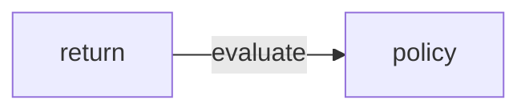
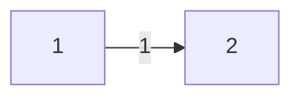

[toc]
# State Value and Bellman Equation
## 1.Return to Bellman Equation

###  Importance of return 

$return$ 将直观上的优劣以数学的方式进行了精确描述。是重要的对$policy$的评价的工具
以上图为例
$r_1 = 0 + 1 + 1 = 2$
$r_2 = -1 + 1 + 1 = 1$
$r_3 = 0.5*(-1 + 0) + 1 + 1 = 1.5$
即policy1 > policy3 > policy2符合直观上对策略的评价

&emsp;
&emsp;

### How to caculate return

Method 1:by definition
$v_1 = r_1 + \gamma r_2 +\gamma ^2 r_3 + ...$  
$v_2 = r_2 + \gamma r_3 +\gamma ^2 r_4 + ...$  
$v_3 = r_3 + \gamma r_4 +\gamma ^2 r_1 + ...$  
$v_1 = r_4 + \gamma r_1 +\gamma ^2 r_2 + ...$  

Method 2:
由定义易推得
$v_1 = r_1 +\gamma (r_2 +\gamma  r_3 + ...)= r_1 + \gamma v_2$ 
$v_2 = r_2 +\gamma (r_3 +\gamma  r_4 + ...)= r_2 + \gamma v_3$ 
$v_3 = r_3 +\gamma (r_4 +\gamma  r_1 + ...)= r_3 + \gamma v_4$ 
$v_4 = r_4 +\gamma (r_1 +\gamma  r_2 + ...)= r_4 + \gamma v_1$ 
显然，当前的状态的价值，依赖于其他状态的价值，称Bootstrapping（由自身出发，迭代得到其他结果）
将上述表达式改写作矩阵形式
$$ v = 
\begin{bmatrix}
v_1\\v_2\\v_3\\v_4
\end{bmatrix}
$$
$$
r = 
\begin{bmatrix}
r_1\\r_2\\r_3\\r_4
\end{bmatrix}
$$
$$
 P = 
\begin{bmatrix} 
1 & x & x^2 & x^3\\ 
1 & y & y^2 & y^3\\ 
1 & z & z^2 & z^3\\ 
\end{bmatrix} 
$$
$$
可得*bellman equation:*
$v = r + \gamma Pv$
$v= r(I-\gamma P)^{-1}$
## 
### State value

